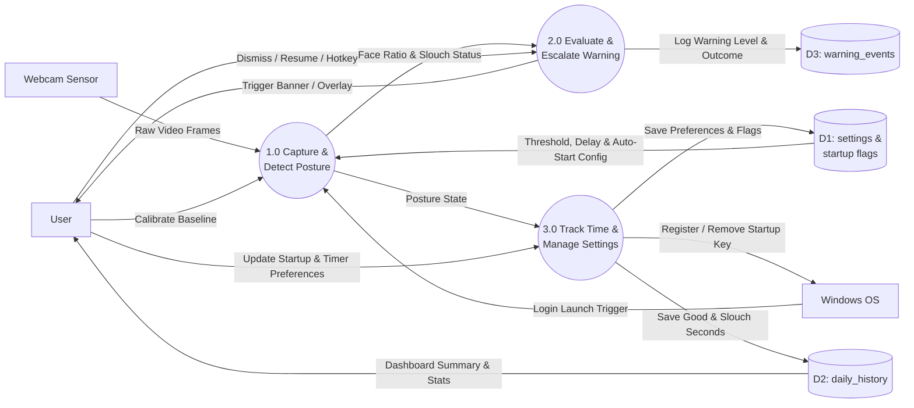
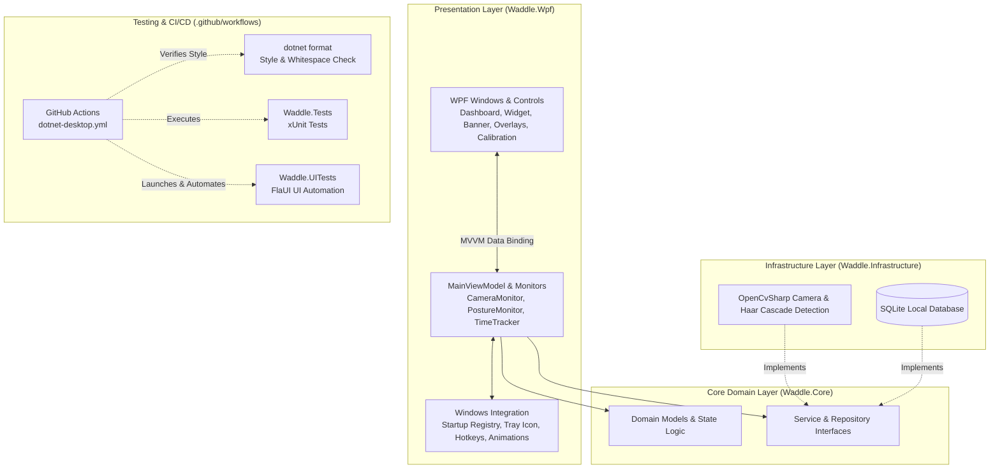
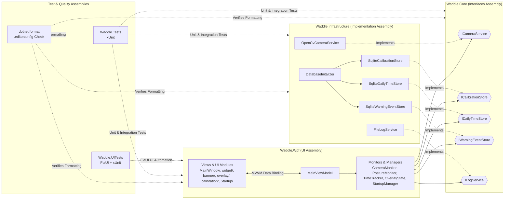

## System Diagrams

### 1. Data Flow Diagram (DFD)

```mermaid
flowchart LR
    %% External Entities
    User[User]
    Webcam[Webcam Sensor]
    WindowsOS[Windows OS]

    %% Processes
    P1((1.0 Capture &<br/>Detect Posture))
    P2((2.0 Evaluate &<br/>Escalate Warning))
    P3((3.0 Track Time &<br/>Manage Settings))

    %% Data Stores
    D1[(D1: settings &<br/>startup flags)]
    D2[(D2: daily_history)]
    D3[(D3: warning_events)]

    %% Data Flows
    Webcam -->|Raw Video Frames| P1
    User -->|Calibrate Baseline| P1
    D1 -->|Threshold, Delay & Auto-Start Config| P1
    WindowsOS -->|Login Launch Trigger| P1
    P1 -->|Face Ratio & Slouch Status| P2
    P1 -->|Posture State| P3

    P2 -->|Trigger Banner / Overlay| User
    User -->|Dismiss / Resume / Hotkey| P2
    P2 -->|Log Warning Level & Outcome| D3

    User -->|Update Startup & Timer Preferences| P3
    P3 -->|Save Preferences & Flags| D1
    P3 -->|Register / Remove Startup Key| WindowsOS
    P3 -->|Save Good & Slouch Seconds| D2
    D2 -->|Dashboard Summary & Stats| User
```
### 2. System Architecture Diagram

```mermaid
flowchart TB
    subgraph Presentation ["Presentation Layer (Waddle.Wpf)"]
        UI[WPF Windows & Controls<br/>Dashboard, Widget, Banner, Overlays, Calibration]
        VM[MainViewModel & Monitors<br/>CameraMonitor, PostureMonitor, TimeTracker]
        UIServices[Windows Integration<br/>Startup Registry, Tray Icon, Hotkeys, Animations]
    end

    subgraph Domain ["Core Domain Layer (Waddle.Core)"]
        Entities[Domain Models & State Logic]
        Interfaces[Service & Repository Interfaces]
    end

    subgraph Infra ["Infrastructure Layer (Waddle.Infrastructure)"]
        OpenCV[OpenCvSharp Camera & Haar Cascade Detection]
        SQLite[(SQLite Local Database)]
    end

    subgraph Quality ["Testing & CI/CD (.github/workflows)"]
        Format[dotnet format<br/>Style & Whitespace Check]
        Unit[Waddle.Tests<br/>xUnit Tests]
        E2E[Waddle.UITests<br/>FlaUI UI Automation]
        Actions[GitHub Actions<br/>dotnet-desktop.yml]
    end

    UI <-->|MVVM Data Binding| VM
    VM <--> UIServices
    VM --> Interfaces
    VM --> Entities
    OpenCV -.->|Implements| Interfaces
    SQLite -.->|Implements| Interfaces
    Actions -.->|Verifies Style| Format
    Actions -.->|Executes| Unit
    Actions -.->|Launches & Automates| E2E
```

### 3. Component Diagram

```mermaid
flowchart LR
    subgraph Waddle_Wpf ["Waddle.Wpf (UI Assembly)"]
        Views["Views & UI Modules<br/>MainWindow, widget/, banner/, overlay/, calibration/, Startup/"]
        VM[MainViewModel]
        Monitors["Monitors & Managers<br/>CameraMonitor, PostureMonitor, TimeTracker, OverlayState, StartupManager"]
    end

    subgraph Waddle_Core ["Waddle.Core (Interfaces Assembly)"]
        ICam{{ICameraService}}
        ICal{{ICalibrationStore}}
        ITime{{IDailyTimeStore}}
        IWarn{{IWarningEventStore}}
        ILog{{ILogService}}
    end

    subgraph Waddle_Infra ["Waddle.Infrastructure (Implementation Assembly)"]
        OpenCV[OpenCvCameraService]
        DbInit[DatabaseInitalizer]
        SqlCal[SqliteCalibrationStore]
        SqlTime[SqliteDailyTimeStore]
        SqlWarn[SqliteWarningEventStore]
        FileLog[FileLogService]
    end

    subgraph Waddle_Tests ["Test & Quality Assemblies"]
        FormatCheck[dotnet format<br/>.editorconfig Check]
        UnitTests[Waddle.Tests<br/>xUnit]
        UITests[Waddle.UITests<br/>FlaUI + xUnit]
    end

    Views <-->|MVVM Data Binding| VM
    VM --> Monitors
    Monitors --> ICam & ICal & ITime & IWarn & ILog

    OpenCV -.->|Implements| ICam
    SqlCal -.->|Implements| ICal
    SqlTime -.->|Implements| ITime
    SqlWarn -.->|Implements| IWarn
    FileLog -.->|Implements| ILog
    DbInit --> SqlCal & SqlTime & SqlWarn

    FormatCheck -.->|Verifies Formatting| Waddle_Core & Waddle_Infra & Waddle_Wpf & Waddle_Tests
    UnitTests -.->|Unit & Integration Tests| Waddle_Core & Waddle_Infra & Waddle_Wpf
    UITests -.->|FlaUI UI Automation| Waddle_Wpf
```
### 4. Class Diagram

```mermaid
classDiagram
    %% Waddle.Core Interfaces
    class ICameraService {
        <<interface>>
    }
    class ICalibrationStore {
        <<interface>>
    }
    class IDailyTimeStore {
        <<interface>>
    }
    class IWarningEventStore {
        <<interface>>
    }
    class ILogService {
        <<interface>>
    }

    %% Waddle.Infrastructure Implementations
    class OpenCvCameraService
    class SqliteCalibrationStore
    class SqliteDailyTimeStore
    class SqliteWarningEventStore
    class FileLogService
    class DatabaseInitalizer

    %% Waddle.Wpf Classes
    class MainWindow
    class SettingsPanel
    class StartupManager
    class MainViewModel
    class CameraMonitor
    class PostureMonitor
    class TimeTracker
    class OverlayState

    %% Interface Implementations
    OpenCvCameraService ..|> ICameraService : implements
    SqliteCalibrationStore ..|> ICalibrationStore : implements
    SqliteDailyTimeStore ..|> IDailyTimeStore : implements
    SqliteWarningEventStore ..|> IWarningEventStore : implements
    FileLogService ..|> ILogService : implements

    %% Database Initialization
    DatabaseInitalizer --> SqliteCalibrationStore : initializes schema
    DatabaseInitalizer --> SqliteDailyTimeStore : initializes schema
    DatabaseInitalizer --> SqliteWarningEventStore : initializes schema

    %% WPF Dependencies
    MainWindow --> SettingsPanel : hosts overlay
    MainWindow --> StartupManager : checks auto-start on load
    SettingsPanel --> StartupManager : reads/writes startup & timer flags
    MainViewModel --> CameraMonitor
    MainViewModel --> PostureMonitor
    MainViewModel --> TimeTracker
    MainViewModel --> OverlayState

    CameraMonitor --> ICameraService : captures frames via
    CameraMonitor --> ICalibrationStore : reads baseline via
    PostureMonitor --> IWarningEventStore : logs alerts via
    TimeTracker --> IDailyTimeStore : persists seconds via
    PostureMonitor --> ILogService : logs events via
```